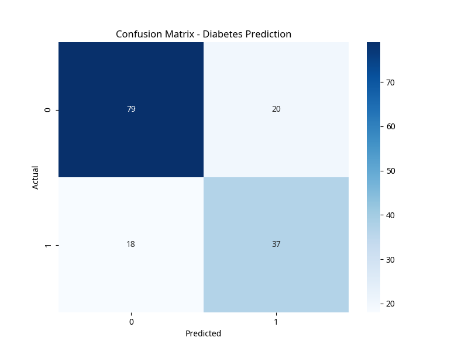
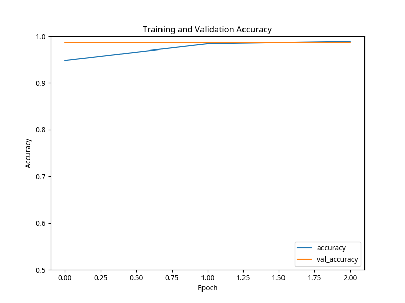
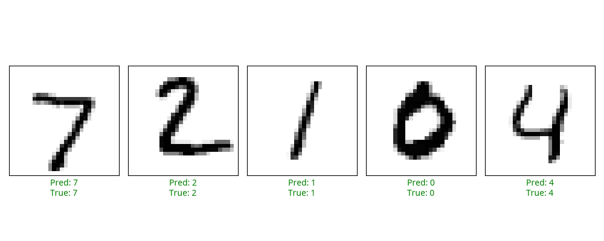

# 🎓 CodeAlpha Internship Tasks: Machine Learning and Data Science Projects

This repository showcases machine learning and data science projects completed during my internship at **CodeAlpha**. These projects demonstrate practical applications of various algorithms to solve real-world problems, focusing on clear problem definition, data handling, model development, and rigorous evaluation.

---

## 📂 Projects Overview

### 1. Diabetes Prediction

**Problem Statement:**
To develop a predictive model that can accurately determine the likelihood of diabetes in patients based on several diagnostic measurements. Early and accurate prediction of diabetes can aid in timely intervention and management, potentially reducing severe health complications.

**Dataset:**
The PIMA Indians Diabetes Database is used for this project. This dataset is publicly available and can be accessed from the UCI Machine Learning Repository [1]. The dataset consists of various diagnostic measurements and a binary outcome variable indicating whether the patient has diabetes.

**Steps:**
1.  **Data Loading and Initial Inspection:** The dataset is loaded using Pandas, and a preliminary view of the data is performed.
2.  **Feature-Label Split:** The dataset is divided into features (X) and the target variable (y), which is the 'Outcome' column.
3.  **Data Standardization:** `StandardScaler` from `scikit-learn` is applied to normalize the feature set, ensuring that all features contribute equally to the model training.
4.  **Train-Test Split:** The data is split into training and testing sets (80% train, 20% test) to evaluate the model's performance on unseen data.
5.  **Model Training:** A Logistic Regression model is trained on the standardized training data.
6.  **Prediction:** The trained model makes predictions on the test set.
7.  **Evaluation:** The model's performance is assessed using accuracy, precision, recall, F1-score, and a confusion matrix.

**Model Explanation:**
**Logistic Regression** is a statistical model that in its basic form uses a logistic function to model a binary dependent variable. It measures the relationship between the categorical dependent variable and one or more independent variables by estimating probabilities using a logistic function. In this project, it predicts the probability of a patient having diabetes (binary outcome: 0 or 1).

**Results:**
The model achieved an accuracy of **75.32%** on the test set. Detailed metrics and the confusion matrix are provided below.



```text
Diabetes Prediction Results
===========================
Accuracy: 0.7532
Precision: 0.6491
Recall: 0.6727
F1-Score: 0.6607

Classification Report:
              precision    recall  f1-score   support

           0       0.81      0.80      0.81        99
           1       0.65      0.67      0.66        55

    accuracy                           0.75       154
   macro avg       0.73      0.74      0.73       154
weighted avg       0.76      0.75      0.75       154
```

### 2. MNIST Digit Classification (CNN)

**Problem Statement:**
To build and train a Convolutional Neural Network (CNN) capable of accurately classifying handwritten digits from the MNIST dataset. This project addresses the fundamental computer vision task of image recognition, which has broad applications in areas like optical character recognition and autonomous systems.

**Dataset:**
The MNIST (Modified National Institute of Standards and Technology) dataset is a large database of handwritten digits that is commonly used for training various image processing systems. The dataset is automatically loaded via TensorFlow/Keras [2].

**Steps:**
1.  **Data Loading and Preprocessing:** The MNIST dataset is loaded, and the images are normalized and reshaped to fit the CNN input requirements.
2.  **CNN Model Architecture:** A sequential CNN model is constructed with multiple convolutional layers, max-pooling layers, and dense layers for classification.
3.  **Model Compilation:** The model is compiled using the Adam optimizer and Sparse Categorical Crossentropy loss function, with accuracy as the primary metric.
4.  **Model Training:** The CNN is trained on the training data for 3 epochs, with a validation split to monitor performance.
5.  **Evaluation:** The trained model is evaluated on the test set to determine its accuracy and loss.
6.  **Visualization:** Training accuracy and sample predictions are visualized to demonstrate the model's learning process and performance.

**Model Explanation:**
A **Convolutional Neural Network (CNN)** is a class of deep neural networks, most commonly applied to analyzing visual imagery. CNNs use a specialized architecture that includes convolutional layers (to detect features), pooling layers (to reduce dimensionality), and fully connected layers (for classification). This architecture allows CNNs to automatically learn hierarchical features from input images, making them highly effective for tasks like image classification.

**Results:**
The CNN model achieved a test accuracy of **98.78%**. The training and validation accuracy plot, along with sample predictions, are shown below.





```text
MNIST CNN Classification Results
================================
Test Accuracy: 0.9878
Test Loss: 0.0393
```

---

## 🛠️ Technologies Used
- **Language**: Python
- **Libraries**:
  - `Pandas` & `NumPy` for data manipulation.
  - `Scikit-learn` for traditional machine learning models.
  - `TensorFlow` / `Keras` for deep learning.
  - `Matplotlib` & `Seaborn` for data visualization.

---

## 🚀 How to Run
1.  **Clone the Repository**:
    ```bash
    git clone https://github.com/Tawhidrahman292/codealpha_tasks.git
    cd codealpha_tasks
    ```
2.  **Install Dependencies**:
    ```bash
    pip install -r requirements.txt
    ```
    *(Note: Ensure you have Python installed on your system. A `requirements.txt` file will be added soon.)*
3.  **Execute Scripts**:
    ```bash
    python diabetes_prediction.py
    python mnist_cnn.py
    ```

---

## 📜 License
This project is licensed under the **MIT License** - see the [LICENSE](LICENSE) file for details.

---

## References
[1] Pima Indians Diabetes Database. UCI Machine Learning Repository. Available at: [https://archive.ics.uci.edu/ml/datasets/Pima+Indians+Diabetes](https://archive.ics.uci.edu/ml/datasets/Pima+Indians+Diabetes)
[2] MNIST Database of Handwritten Digits. Available at: [http://yann.lecun.com/exdb/mnist/](http://yann.lecun.com/exdb/mnist/)
